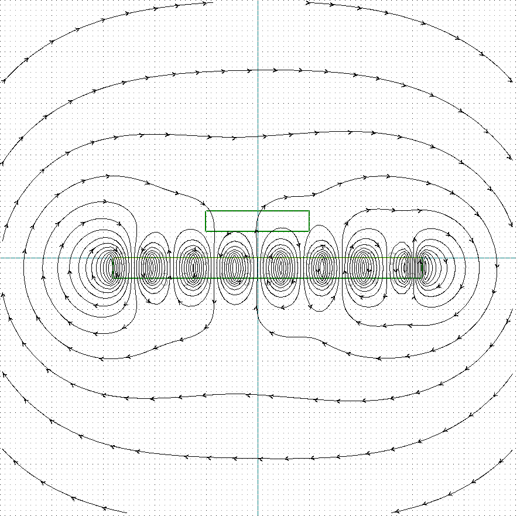

# E1: Hallbach Array
Question: Does it make sense to use a hallbach array for the stator?

Given:
- fixed air gap of 5mm
- same number of magnets
- 4x4x4 Neodym N42 (1.305 T) on the stator
- long stator length

Variables:
- N/S alignment of the stator's magnets

Targets:
- Magnetic field strength directly above air gap
- Direction of the magnetic field

Result:
- Hallbach array is approx. twice as strong as the 

## Halbach Array
Max Flux: 0.25 T with alternating directions (approx. sinus with period of 16mm)

at the lower end of the marking box (at the airgap)

Coutour Lines at 0.05, 0.1, 0.15, 0.2, 0.25

### N/S alternating
Max Flux: 0.041T with alternating directions (approx. sinus with period of 8mm - half that of the other scenarios)

at the lower end of the marking box (at the airgap)

Coutour Lines at 0.05, 0.1, 0.15, 0.2, 0.25

## N/N/S/S sequence
Max Flux: 0.125T with alternating directions (approx. sinus with period of 16mm)

at the lower end of the marking box (at the airgap)

Coutour Lines at 0.05, 0.1, 0.15, 0.2, 0.25

