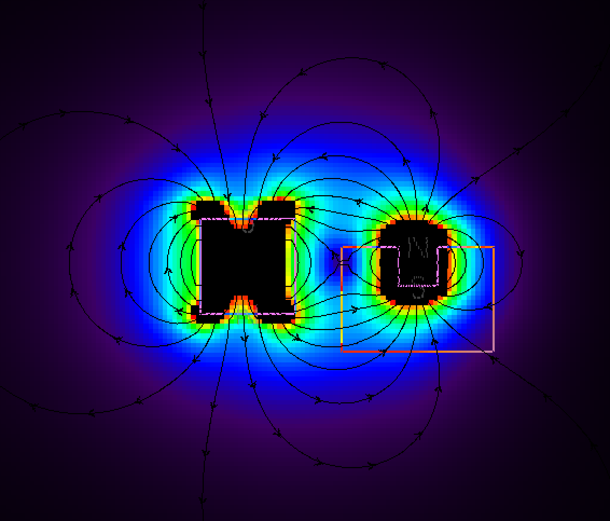

# E10: Rail Guide Solenoid Shape
Question: What is the best shape of the solenoid to have maximum impact on the rail?

Given:
- rail is 4x4x12 Neodym N42 (1.305 T)
- target air gap between the rail and the end of the solenoid of 5mm
- solenoid with
  - permeability of 500
  - 300 mA
  - S pole towards top
  - base size: 10x10x10mm  (cylinder) - 5000 turns

Target:
- maximal horizontal force (x-direction, positive in this scenario)

Variable:
- height vs. width of the solenoid

Observations:
- higher solenoids with same number of turns provide slightly less strong Px but over a bigger y range

Result:
- go as big as possible, because we will use less current that way and hopefully avoid the heating problem

see [Google Sheets](https://docs.google.com/spreadsheets/d/1-nTOAxxbFqjPpGzVE3cWuoPyFOnyhRpN7xA-p9OE-tk/edit#gid=1321953808) for detailed data.

## Basic setup:

## Simplified experiment

|                 | Px            |             |                |             |   | Weird ones (non-tightly wound) |             |
|-----------------|---------------|-------------|----------------|-------------|---|--------------------------------|-------------|
|                 | 300mA, n=5000 |             | 300mA, n=10000 |             |   | n=5000                         | n=5000      |
| y Position (mm) | 10mm x 10mm   | 20mm x 10mm | 10mm x 20mm    | 20mm x 20mm |   | 10mm x 20mm                    | 20mm x 20mm |
| 4               | 0.53          | 1.02        | 1.22           | 2.19        |   | 0.63                           | 1.15        |
| 2               | 0.64          | 1.21        | 1.28           | 2.33        |   | 0.66                           | 1.21        |
| 0               | 0.70          | 1.31        | 1.37           | 2.49        |   | 0.67                           | 1.23        |
| -2              | 0.64          | 1.22        | 1.28           | 2.33        |   | 0.66                           | 1.19        |
| -4              | 0.53          | 1.03        | 1.22           | 2.19        |   | 0.61                           | 1.12        |

- going higher with the same amount of turns does not change the field much: it gets a bit weaker (Px) but has more tolerance in y direction (weakens slower when moved vertically)
- 20x20 is best - simply because it's a bigger electro magnet

## Current change

|                        | 10mm x 10mm | 20mm x 10mm | 10mm x 20mm | 20mm x 20mm |
|------------------------|-------------|-------------|-------------|-------------|
| approx len of wire (m) | 13          | 26          | 26          | 52          |
| resistance (ohm)       | 8           | 15          | 15          | 30          |
| Voltage (V)            | 9           | 9           | 9           | 9           |
| current (mA)           | 1199        | 600         | 600         | 300         |
| turns (n)              | 5000        | 5000        | 10000       | 10000       |
| Px in N at 0mm         | 3.30        | 5.55        | 3.09        | 2.52        |

Problem here is that 1.2A of current will get the wire melting and Raspberry Pi cannot deliver that much.