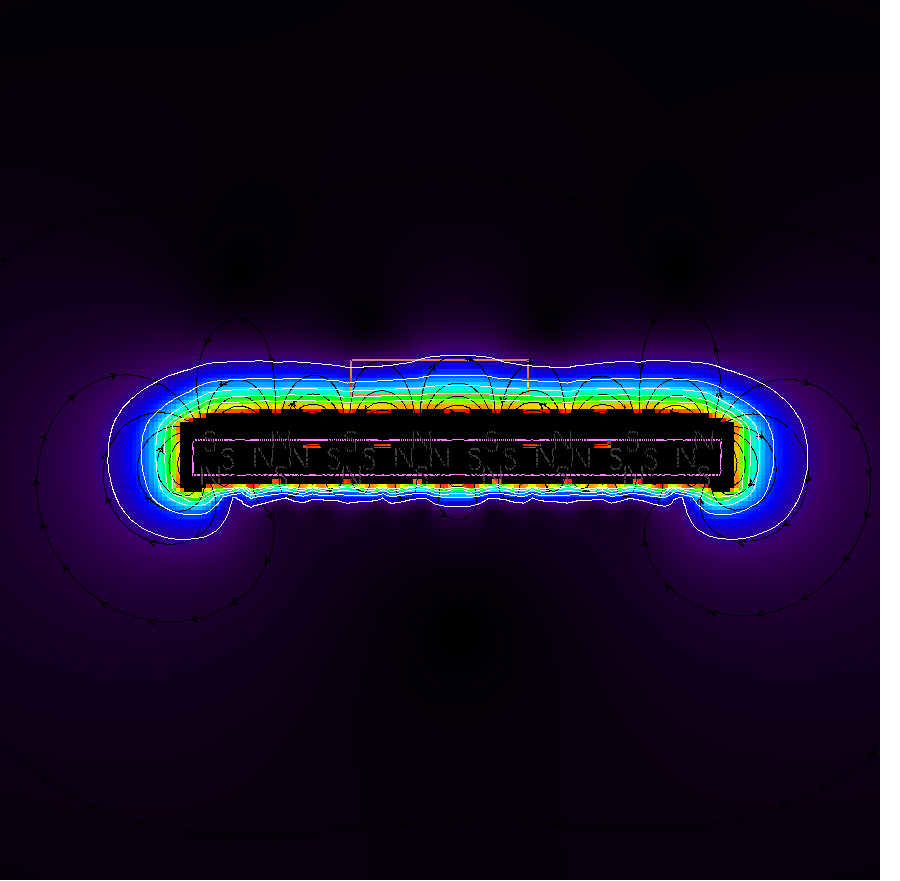
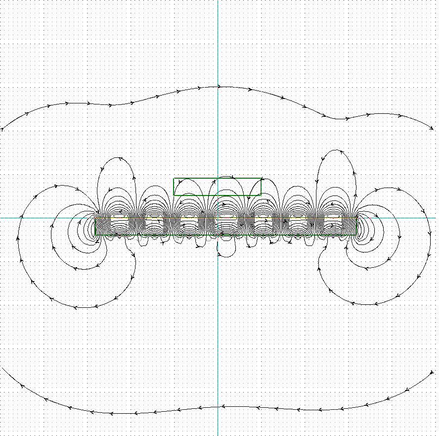
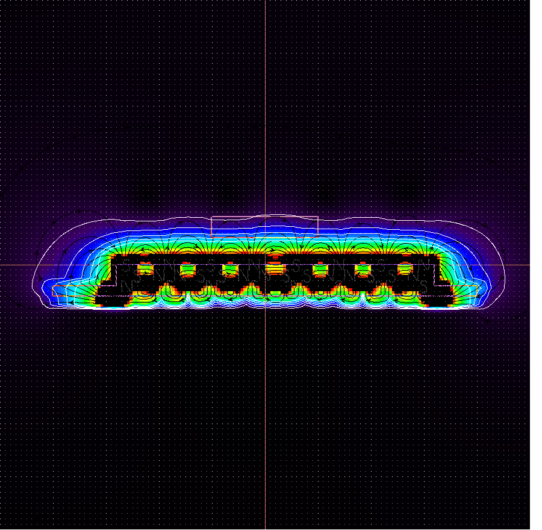
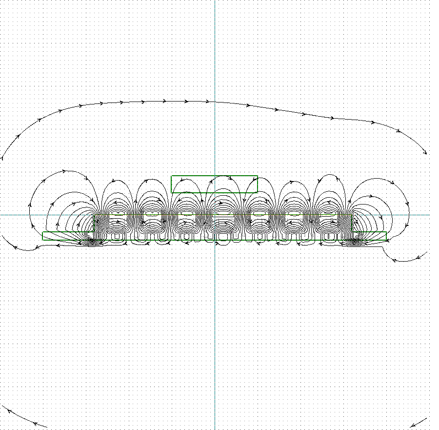
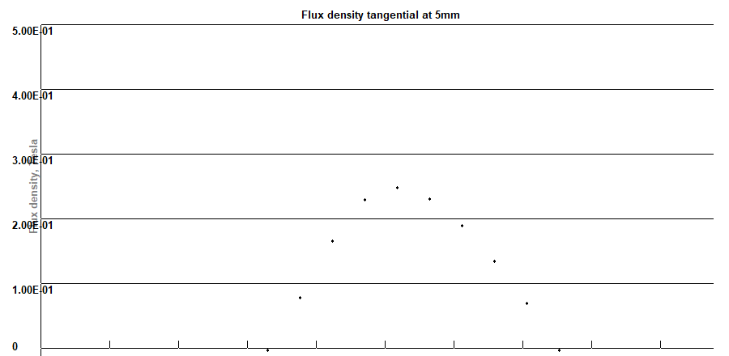
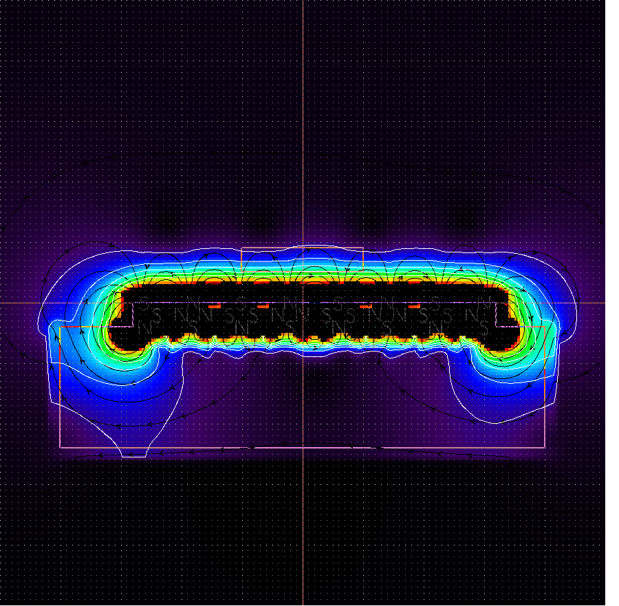
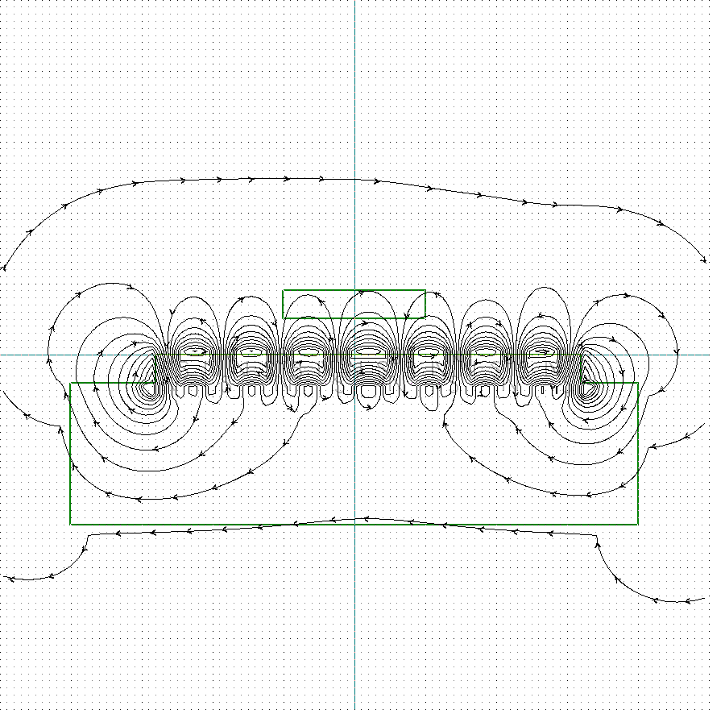

# E1: Hallbach Array
Question: Does adding an iron sheet under the halbach array provide any benefit?

Given:
- fixed air gap of 5mm
- same number and alignment of magnets
- 4x4x4 Neodym N42 (1.305 T) on the stator
- long stator length

Targets:
- Magnetic field strength directly above air gap
- Direction of the magnetic field

Result:
- Does not make any difference at all

## Without Steel Sheet
Max Flux: 0.25 T with alternating directions (approx. sinus with period of 16mm)

at the lower end of the marking box (at the airgap)

Coutour Lines at 0.05, 0.1, 0.15, 0.2, 0.25

## With 2mm Steel Sheet
Assuming permeability of 800 for the sheet.

Max Flux: 0.25 T with alternating directions (approx. sinus with period of 16mm)

at the lower end of the marking box (at the airgap)

Coutour Lines at 0.05, 0.1, 0.15, 0.2, 0.25

## With 20mm Steel Sheet
Assuming permeability of 800 for the sheet.

Max Flux: 0.25 T with alternating directions (approx. sinus with period of 16mm)

at the lower end of the marking box (at the airgap)

Coutour Lines at 0.05, 0.1, 0.15, 0.2, 0.25

