# E1: Hallbach Array
Question: How much does adding empty space between the strator magnets lessen the magnetic field?

Given:
- fixed air gap of 5mm
- 4x4x4 Neodym N42 (1.305 T) in halbach alignment on the stator
- long stator length

Targets:
- Magnetic field strength directly above air gap
- Direction of the magnetic field

Observations:
- 4mm spacing still has sinus like fields, a bit lower strength (-12%)
- Halbach start collapsing at 6mm spacing, -25% strength
- after 8mm (30% strength): no longer continiuous field (bumps on either side)

Result:
- Field strength changes approx. linearly with gap with ~0.083 T/mm
- at 6mm its no longer continuous

## Without Spacing
Max Flux: 0.25 T with alternating directions (approx. sinus with period of 16mm)

at the lower end of the marking box (at the airgap)

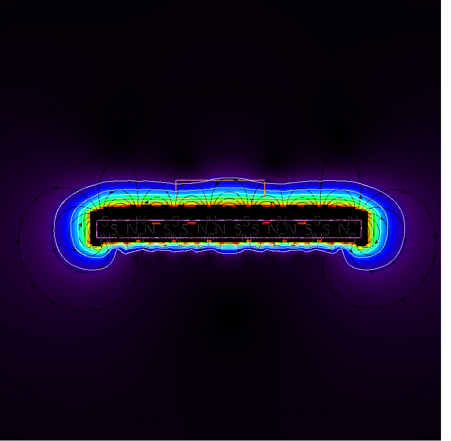
Coutour Lines at 0.05, 0.1, 0.15, 0.2, 0.25

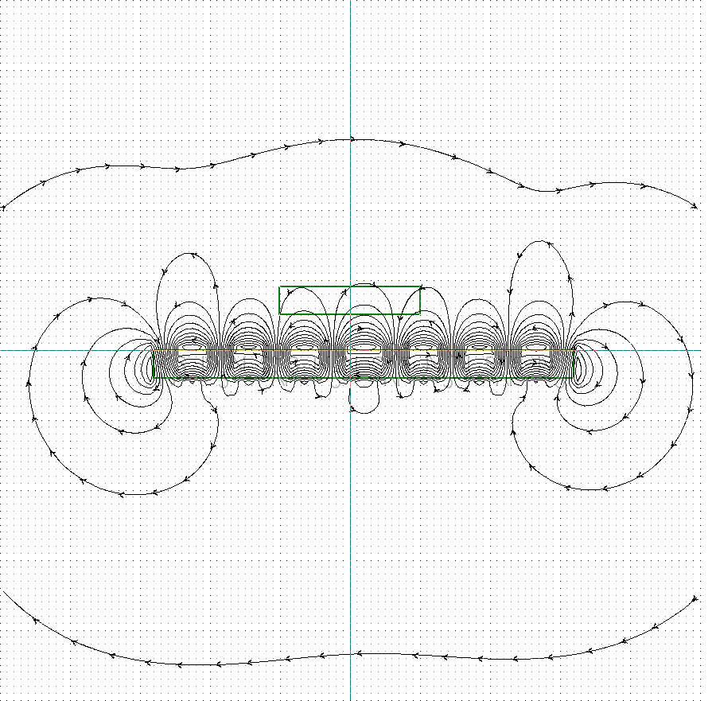

## With 4mm Spacing
Max Flux: 0.22 T with alternating directions (approx. sinus with period of 32 mm)

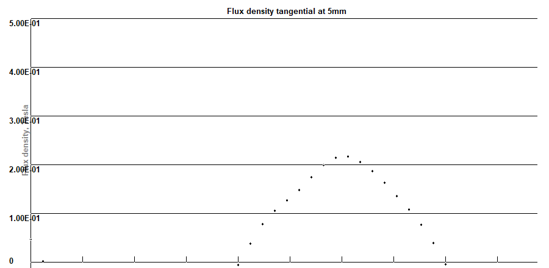
at the lower end of the marking box (at the airgap). Attention: diffenrent length of plot.

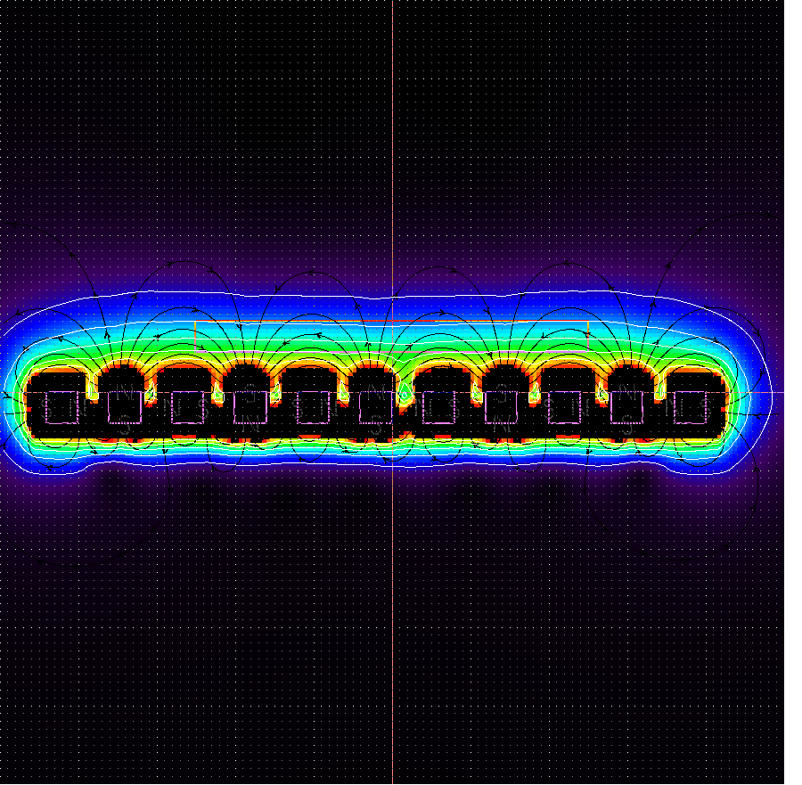
Coutour Lines at 0.05, 0.1, 0.15, 0.2, 0.25

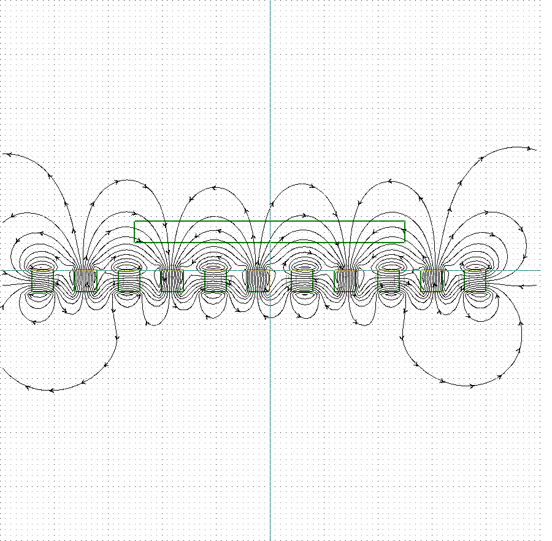

## With 6mm Spacing
Max Flux: 0.19 T with alternating directions (approx. sinus with period of 40 mm)
Lower maximum, no longer an approx. sinus curve.

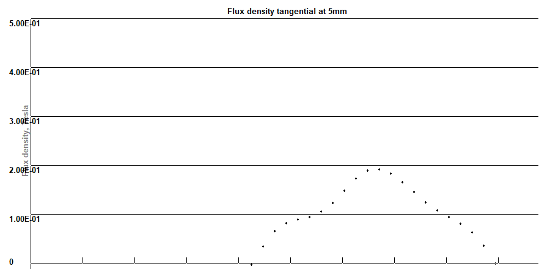
at the lower end of the marking box (at the airgap). Attention: diffenrent length of plot.

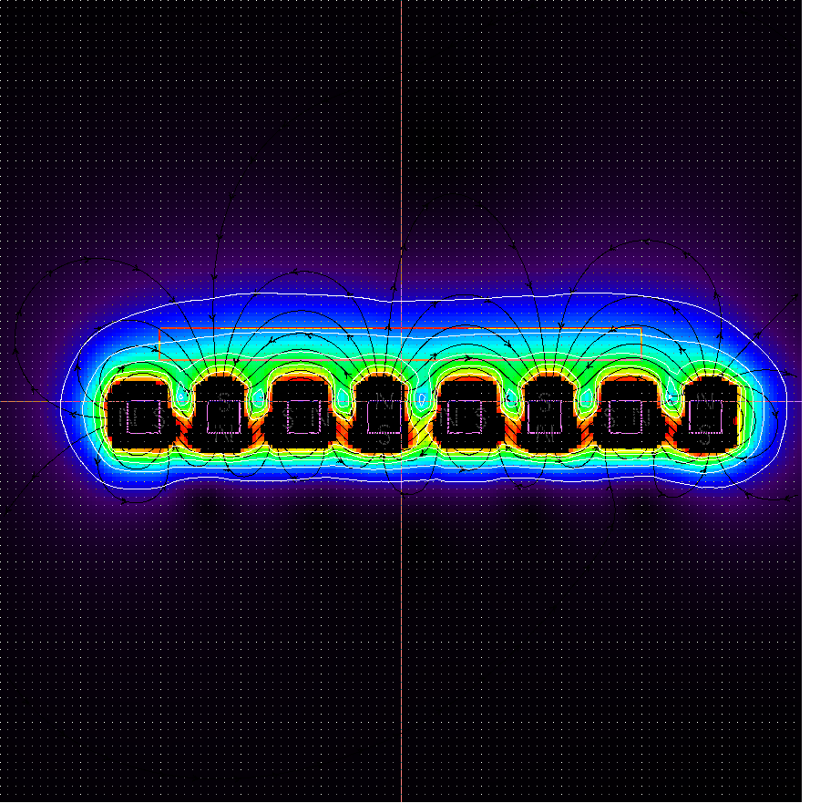
Coutour Lines at 0.05, 0.1, 0.15, 0.2, 0.25

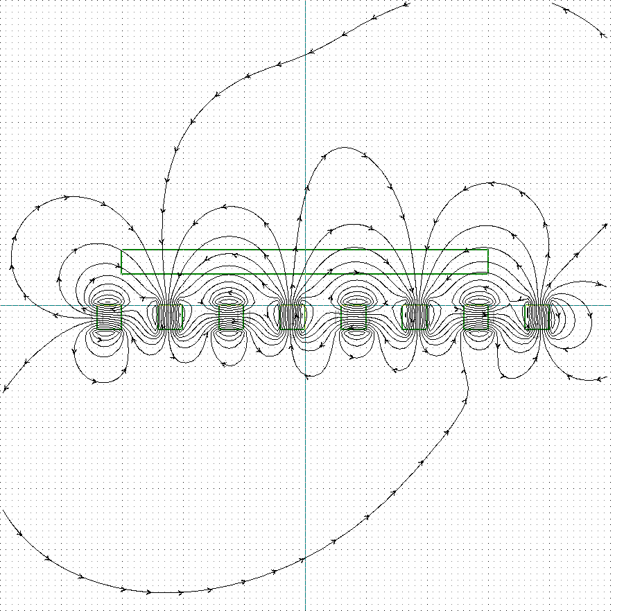

## With 8mm Spacing
Max Flux: 0.18 T with alternating directions (approx. sinus with period of 48 mm).
Lower maximum and a "plain" before the "sinus" bump.

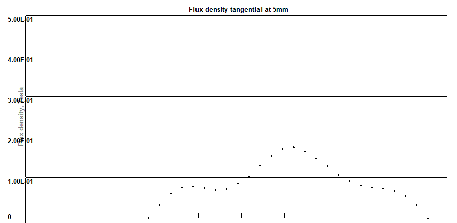
at the lower end of the marking box (at the airgap). Attention: diffenrent length of plot.

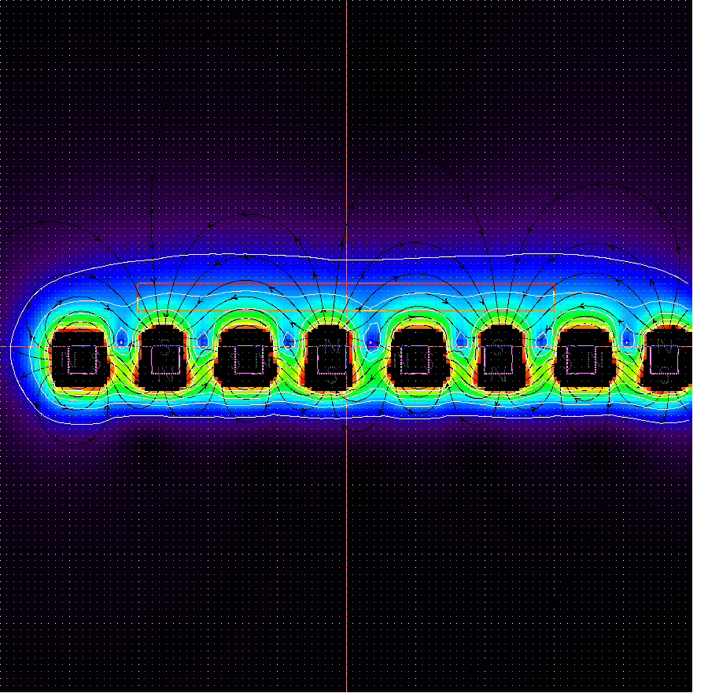
Coutour Lines at 0.05, 0.1, 0.15, 0.2, 0.25

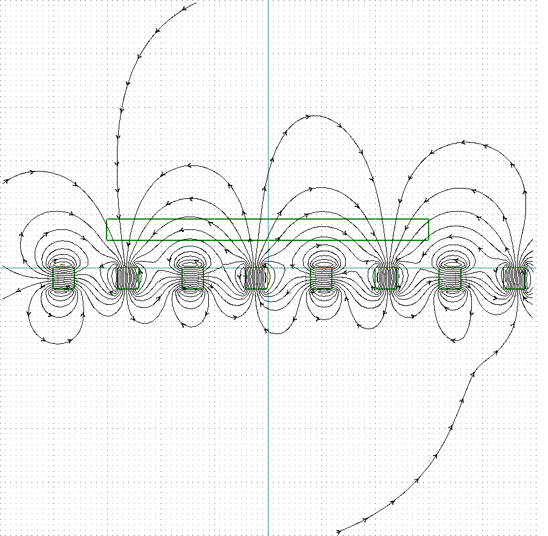

## With 12mm Spacing
Max Flux: 0.15 T with alternating directions (approx. sinus with period of 64 mm).
Lower maximum, bumps in between. Halbach on the verge of collapsing.

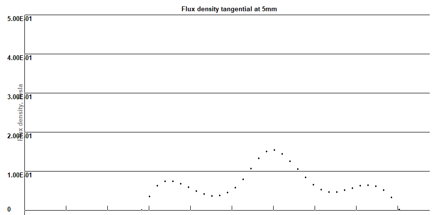
at the lower end of the marking box (at the airgap). Attention: diffenrent length of plot.

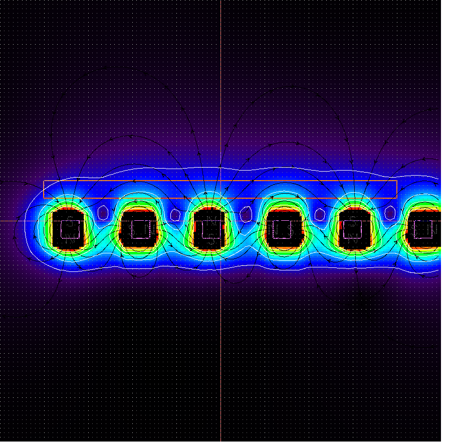
Coutour Lines at 0.05, 0.1, 0.15, 0.2, 0.25

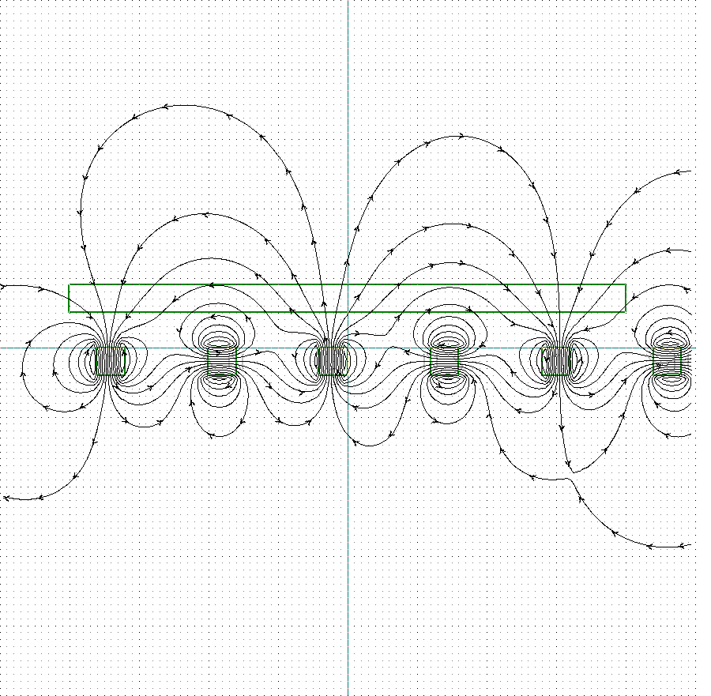
