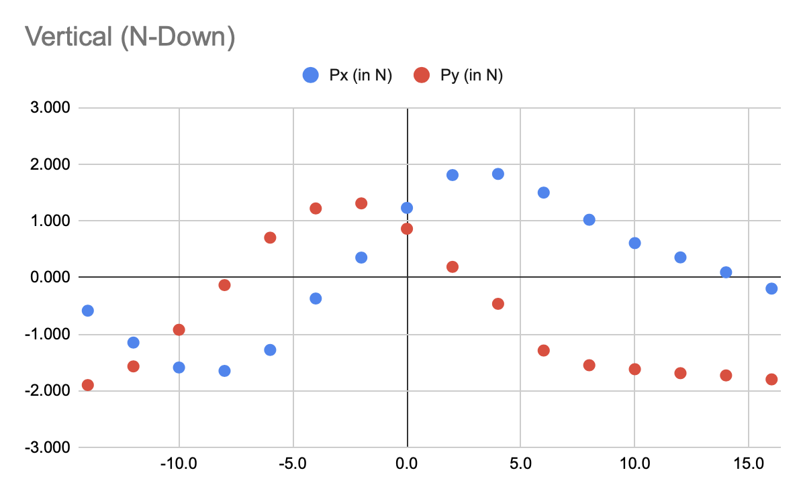

# E4: Orientation
Question: Which orientation of the soleniod does make most sense in regards to providing x-axis force?

Given:
- fixed air gap of 5mm
- 4x4x4 Neodym N42 (1.305 T) in halbach alignment with 4mm spacing on the stator
- long stator length
- round solenoid with
  - outer diameter 10mm, length 10mm
  - permeability of 500
  - 5000 turns, 300 mA
- 8 positions to cover complete period
  - A: directly between S-top and N-right  (-14mm)
  - B: directly above N-right              (-10mm)
  - C: directly between N-right and N-top  (-6mm)
  - D: directly above N-top magnet (-2mm)
  - E: directly between N-top and N-left (+2mm)
  - F: directly above N-left (+6mm)
  - G: directly between N-left and S-top (+10mm)
  - H: directly above S-top (+14mm)

Targets:
- maximal thrust in x direction (parallel to stator)
- limit impact on Py over the period

Observations:
- not that much of a difference, mostly shifted by 6mm (probably actually 5mm)
- horizontal has more extreme values and sharper drop-off
- both with negative impact on Py across period ()
- when switching polarity horizontal has higher Px/Py values
- when switching polarity and turning off when ineffective horizontal has better Px under less impact to Py (strictly better)

Result:
- horizontally aligned solenoid (N facing left/right) is better by approx. 20%

see [Google Sheets](https://docs.google.com/spreadsheets/d/1-nTOAxxbFqjPpGzVE3cWuoPyFOnyhRpN7xA-p9OE-tk/edit#gid=663803625) for detailed data.

## Vertical (N facing down)

| Position | x mm  |   | P (in N) | Px (in N) | Py (in N) |
|----------|-------|---|----------|-----------|-----------|
| A        | -14.0 |   | 1.990    | -0.586    | -1.900    |
|          | -12.0 |   | 1.940    | -1.150    | -1.570    |
| B        | -10.0 |   | 1.840    | -1.590    | -0.924    |
|          | -8.0  |   | 1.650    | -1.650    | -0.134    |
| C        | -6.0  |   | 1.460    | -1.280    | 0.704     |
|          | -4.0  |   | 1.270    | -0.371    | 1.220     |
| D        | -2.0  |   | 1.350    | 0.352     | 1.310     |
|          | 0.0   |   | 1.500    | 1.230     | 0.861     |
| E        | 2.0   |   | 1.720    | 1.810     | 0.188     |
|          | 4.0   |   | 1.890    | 1.830     | -0.465    |
| F        | 6.0   |   | 1.980    | 1.500     | -1.290    |
|          | 8.0   |   | 1.850    | 1.020     | -1.550    |
| G        | 10.0  |   | 1.730    | 0.608     | -1.620    |
|          | 12.0  |   | 1.730    | 0.355     | -1.690    |
| H        | 14.0  |   | 1.730    | 0.092     | -1.730    |
|          | 16.0  |   | 1.810    | -0.196    | -1.800    |

## Vertical with N/S-down switching
Polarity of magnet switches to obtain max horizontal thrust max(Px) per step.

- Total thrust (Px) over period:  17.697 N
- Up/Downforce (Py) over period: - 7.014 N

if turned off at uneffective points (-4,-2,12 and 14mm):
- Total Px:  16.304 N
- Total Py: - 6.124 N

if turned off at uneffective points (-6,-4,-2,10,12 and 14mm):
- Total Px:  14.780 N
- Total Py: - 2.904 N

## Horizontal (N facing right)

| Position | x mm  |   | P (in N) | Px (in N) | Py (in N) |
|----------|-------|---|----------|-----------|-----------|
| A        | -14.0 |   | 1.230    | -1.020    | 0.692     |
|          | -12.0 |   | 1.110    | -0.582    | 0.944     |
| B        | -10.0 |   | 1.080    | -0.108    | 1.070     |
|          | -8.0  |   | 1.180    | 0.415     | 1.110     |
| C        | -6.0  |   | 1.400    | 1.030     | 0.951     |
|          | -4.0  |   | 1.960    | 1.910     | 0.407     |
| D        | -2.0  |   | 2.200    | 2.160     | -0.405    |
|          | 0.0   |   | 2.540    | 2.130     | -1.370    |
| E        | 2.0   |   | 2.610    | 1.490     | -2.140    |
|          | 4.0   |   | 2.890    | 0.807     | -2.780    |
| F        | 6.0   |   | 2.570    | -0.366    | -2.550    |
|          | 8.0   |   | 2.290    | -1.140    | -1.990    |
| G        | 10.0  |   | 2.100    | -1.580    | -1.380    |
|          | 12.0  |   | 1.820    | -1.680    | -0.702    |
| H        | 14.0  |   | 1.520    | -1.520    | -0.004    |
|          | 16.0  |   | 1.280    | -1.210    | 0.410     |

## Horizontal with N/S-right switching
Polarity of magnet switches to obtain max horizontal thrust max(Px) per step.

- Total thrust (Px) over period:  20.602 N
- Up/Downforce (Py) over period: - 9.604 N

if turned off at uneffective points (-10mm and 4mm):
- Total Px:  19.627 N
- Total Py: - 4.124 N

