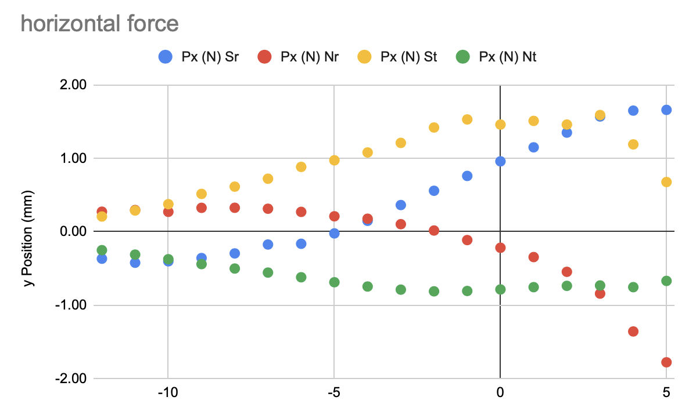
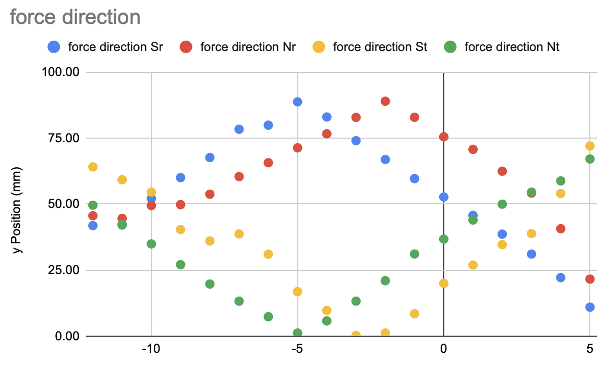
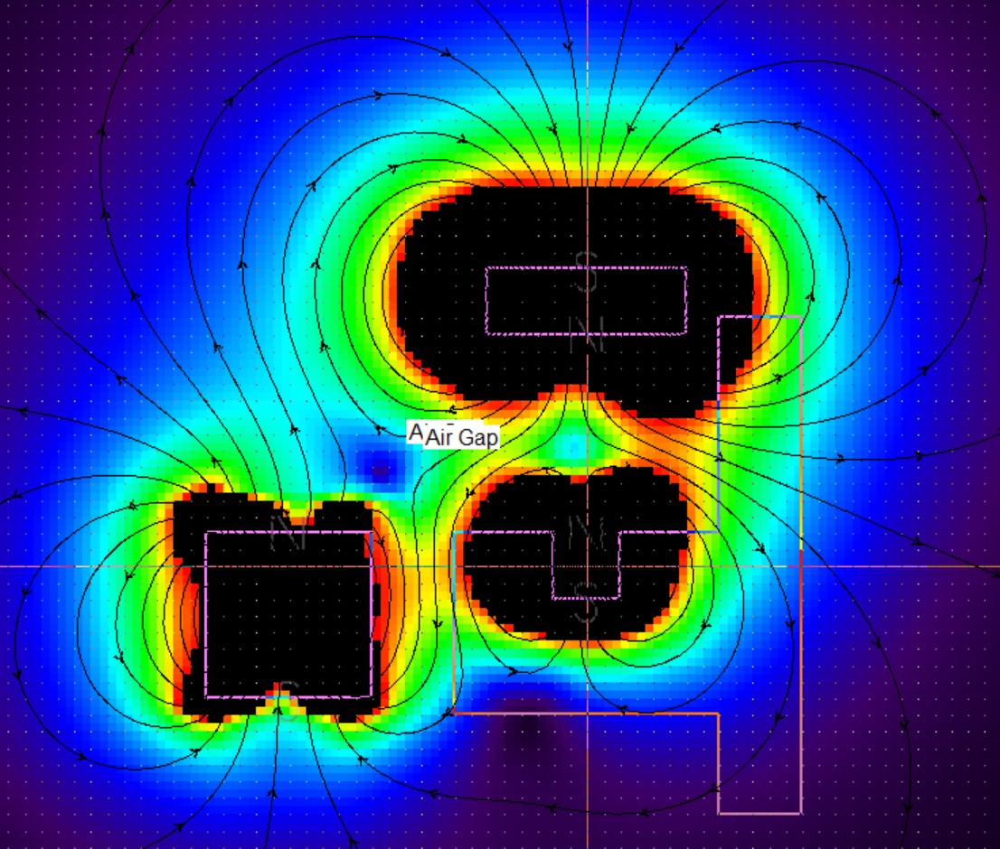
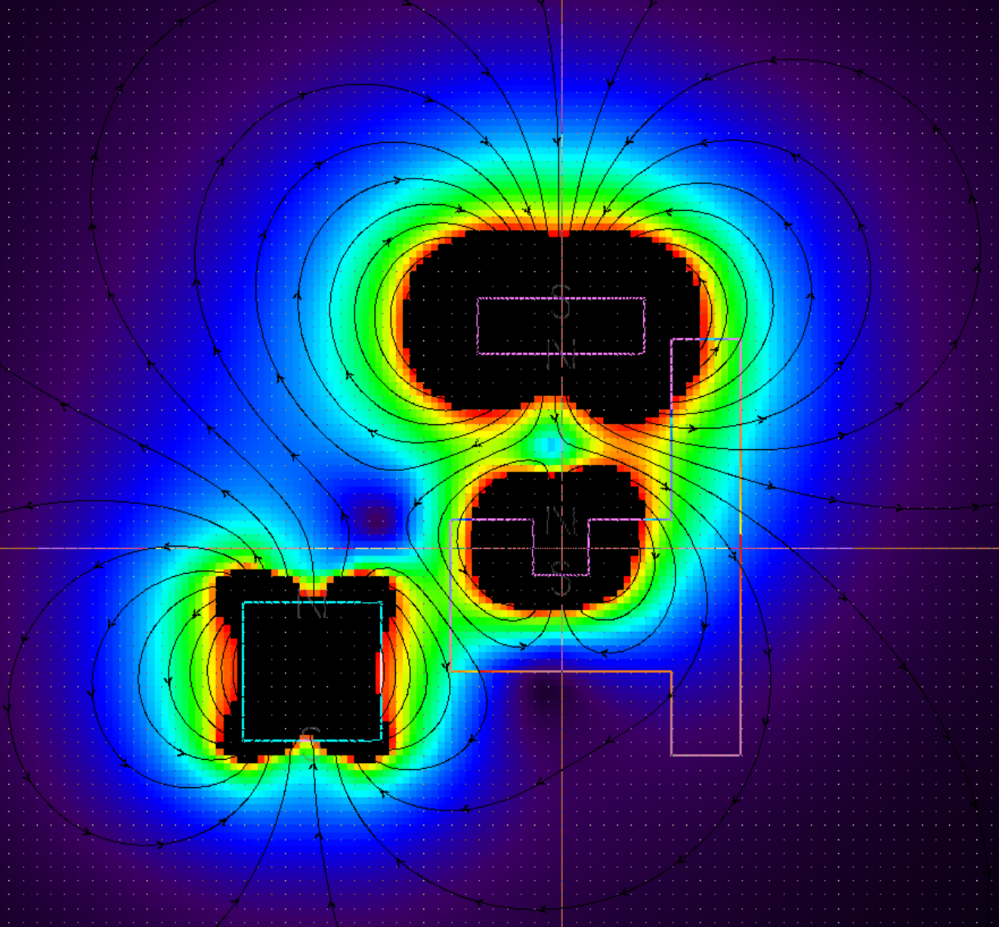

# E9: Rail Guide
Question: Optimal placement of the solenoid to ensure that the car stays aligned betwenn to two rails.

Given:
- rail is 4x4x12 Neodym N42 (1.305 T)
- hover magnet is 4x4x12 Neodym N42 (1.305 T) sidewise (90 deg against rail)
- hover distance is 12mm
- round solenoid with
  - outer diameter 10mm, length 10mm
  - permeability of 500
  - 5000 turns, 300 mA
- target air gap between the rail and the end of the solenoid of 5mm

Targets:
- Maximal horizontal force (x-direction)
- Minimize angle of force towards rail (force mainly in horizontal direction)

Variables:
- Magnet placement (vertical vs horizontal)
- y-Position of solenoid (0 = middle of rail is aligned with middle of solenoid)

Observations:
- N-S towards rail has really bad force direction (45 degrees at best)
- Best behaviour: S towards rail with -3mm distance (slightly below). It is auto stabilizing (pulls towards -3mm), has perfectly horizontal and strong (1.2 N) force.
- Reversed (N towards rail): Good force direction, but non-stable (pushed up-down and does so stronger the more it is away from -3mm)

Result:
- S facing top, solenoid center 3mm below rail-magnet center is optimal (pulls towards rail)
- be careful if reversing the magnet, this is unstable. Probably better to try to only correct with S-top (on the side it is farter away)

see [Google Sheets](https://docs.google.com/spreadsheets/d/1-nTOAxxbFqjPpGzVE3cWuoPyFOnyhRpN7xA-p9OE-tk/edit#gid=2105873856) for detailed data.

# Placement N/S facing rail

|                 | S facing rail |           |                    |   | N facing rail |           |                    |
|-----------------|---------------|-----------|--------------------|---|---------------|-----------|--------------------|
| y Position (mm) | Px (N) Sr     | Py (N) Sr | force direction Sr |   | Px (N) Nr     | Py (N) Nr | force direction Nr |
| 5               | 1.66          | 0.32      | 10.98              |   | -1.78         | -0.71     | 21.61              |
| 4               | 1.65          | 0.67      | 22.16              |   | -1.36         | -1.17     | 40.71              |
| 3               | 1.57          | 0.95      | 31.10              |   | -0.84         | -1.17     | 54.19              |
| 2               | 1.35          | 1.08      | 38.66              |   | -0.55         | -1.05     | 62.48              |
| 1               | 1.15          | 1.18      | 45.74              |   | -0.35         | -0.99     | 70.75              |
| 0               | 0.96          | 1.26      | 52.72              |   | -0.22         | -0.85     | 75.52              |
| -1              | 0.76          | 1.30      | 59.69              |   | -0.11         | -0.92     | 82.92              |
| -2              | 0.56          | 1.31      | 66.93              |   | 0.02          | -0.92     | 89.02              |
| -3              | 0.36          | 1.27      | 74.05              |   | 0.10          | -0.82     | 82.88              |
| -4              | 0.15          | 1.21      | 83.03              |   | 0.18          | -0.75     | 76.67              |
| -5              | -0.02         | 1.10      | 88.78              |   | 0.21          | -0.62     | 71.34              |
| -6              | -0.17         | 0.93      | 79.94              |   | 0.27          | -0.60     | 65.70              |
| -7              | -0.18         | 0.85      | 78.38              |   | 0.31          | -0.55     | 60.45              |
| -8              | -0.30         | 0.72      | 67.68              |   | 0.33          | -0.45     | 53.77              |
| -9              | -0.36         | 0.62      | 60.05              |   | 0.33          | -0.39     | 49.83              |
| -10             | -0.40         | 0.52      | 52.16              |   | 0.27          | -0.32     | 49.47              |
| -11             | -0.42         | 0.38      | 42.08              |   | 0.30          | -0.29     | 44.61              |
| -12             | -0.37         | 0.33      | 41.88              |   | 0.27          | -0.28     | 45.62              |

Px and Py in Newton, direction in degrees (0 means horizontal, 90 means vertical)

# Placement N/S top/bottom (parallel to rail)

|                 | S facing top |           |                    |   | N facing top |           |                    |
|-----------------|--------------|-----------|--------------------|---|--------------|-----------|--------------------|
| y Position (mm) | Px (N) St    | Py (N) St | force direction St |   | Px (N) Nt    | Py (N) Nt | force direction Nt |
| 5               | 0.68         | -2.09     | 72.05              |   | -0.67        | 1.59      | 67.12              |
| 4               | 1.19         | -1.64     | 54.03              |   | -0.76        | 1.25      | 58.83              |
| 3               | 1.59         | -1.28     | 38.84              |   | -0.73        | 1.03      | 54.56              |
| 2               | 1.46         | -1.01     | 34.67              |   | -0.74        | 0.88      | 49.98              |
| 1               | 1.51         | -0.77     | 26.93              |   | -0.76        | 0.73      | 44.00              |
| 0               | 1.46         | -0.53     | 19.99              |   | -0.79        | 0.59      | 36.76              |
| -1              | 1.53         | -0.23     | 8.48               |   | -0.81        | 0.49      | 31.13              |
| -2              | 1.42         | -0.03     | 1.16               |   | -0.81        | 0.31      | 20.99              |
| -3              | 1.21         | 0.01      | 0.24               |   | -0.79        | 0.19      | 13.25              |
| -4              | 1.08         | -0.19     | 9.72               |   | -0.75        | 0.08      | 5.76               |
| -5              | 0.97         | 0.30      | 16.87              |   | -0.69        | -0.01     | 1.16               |
| -6              | 0.88         | 0.53      | 31.02              |   | -0.62        | -0.08     | 7.34               |
| -7              | 0.72         | 0.58      | 38.73              |   | -0.56        | -0.13     | 13.23              |
| -8              | 0.61         | 0.45      | 36.06              |   | -0.50        | -0.18     | 19.73              |
| -9              | 0.52         | 0.44      | 40.38              |   | -0.44        | -0.23     | 27.08              |
| -10             | 0.38         | 0.53      | 54.57              |   | -0.38        | -0.26     | 34.94              |
| -11             | 0.29         | 0.49      | 59.26              |   | -0.31        | -0.28     | 42.31              |
| -12             | 0.21         | 0.43      | 64.14              |   | -0.25        | -0.30     | 49.59              |

Px and Py in Newton, direction in degrees (0 means horizontal, 90 means vertical)

Examples:
- S facing top, -3mm 
- N facing top, -9mm 
